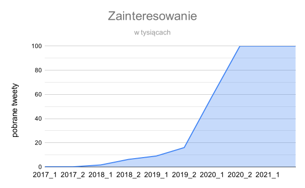
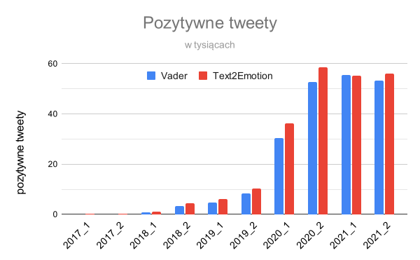
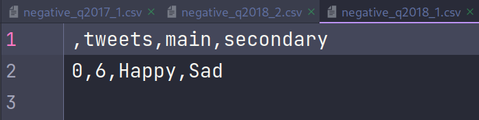
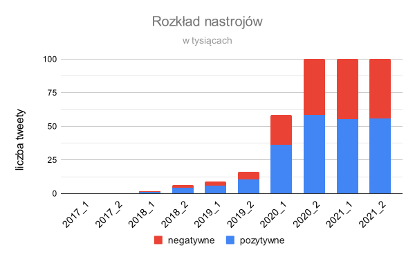
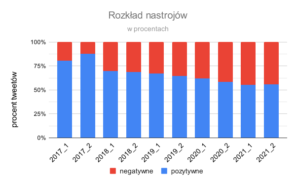
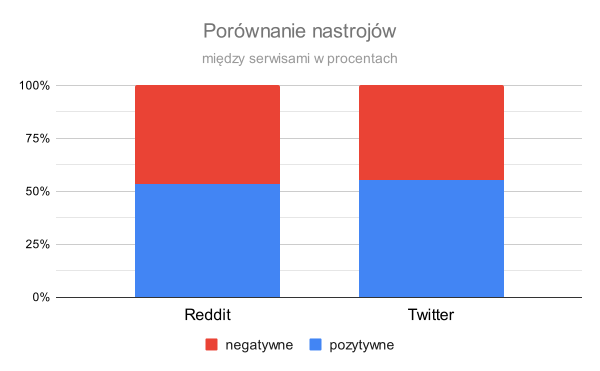
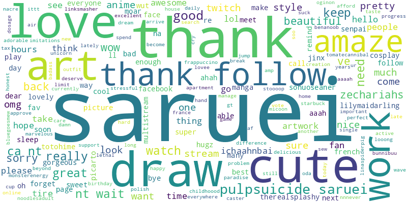

# Badanie fenomenu wirtualnych awatarów i osobowości na przykładzie popularnych jakiś czas temu vTuberów

## Objaśnienie kluczowych pojęć

### Awatar
Jest to <mark>nierzeczywisty</mark> wizerunek reprezentujący w Internecie lub grze rzeczywistego użytkownika. 
**Awatar w tym ujęciu nie jest równy postaci!**

### Wirtualna osobowość
Sposób zachowania, jaki przyjmuje konkretna osoba w Internecie, a który <mark>odbiega od</mark> tego, w jaki zachowuje się ona w <mark>rzeczywistości.</mark> 
**Nie musi to być wcale pojęcie negatywne!** 
Może wynikać na przykład, ze zwiększenia śmiałości w skótek poczucia anonimowości itp.

### vTuber
Pojęcie orginalnie oznaczające YouTubera wykorzystującego w swoich nagraniach w pełni <mark>animowany model</mark> 2D/3D jako swojego awatara. 
Obecnie termin ten rozszerzył się także o wszelkiego rodzaju streamerów wykożystujących tę technologię.

## Jakiego fenomenu???
Bardzo możliwe, że nigdy nie słyszałeś o wirtualnych YouTuberach. Bynajmniej mnie to nie dziwi, ponieważ ów fenomen zasadniczo miał miejsce tylko w pewnej dosyć zamkniętej, choć licznej grupie użytkowników Internetu (tak zwanych *otaku* i... weebów). 
Jednak nie da się nie przyznać, że sami zainteresowani odnieśli imponujące sukcesy. Największa agencja w branży posiada w sumie ponad **50 mln** subskrypcji i łączny dochód netto **1.23 mln USD**.

## Cel i metodologia
### Cel projektu
Celem poniższego projektu jest określenie tendencji (rosnąca/spadkowa) zainteresowania przedmiotem wirtualnych streamerów na Tweeterze przy użyciu Pythona (*snscrape*) oraz trndów w ich ocenie na tej platformie oraz porównaniu ich z wynikami uzyskanymi z Reddita (*praw*).
### Hipoteza wejściowa
Zainteresowanie wzrośnie w początkowych kilku latach, jednak później zacznie stopniowo spadać. Emocje towarzyszące powyższemu tematowi będą silnie ambiwalentne ze względu na silny fandom (*otaku*/weebs) i wysoki poziom "cringu" (aka. żenady), jaki wiąże się z oglądaniem anime dziewczynek w Internecie ;)

### Metodologia
Wykorzystane technologie to Python wraz z paczkami:
* snscrape,
* nltk,
* praw,
* text2emotion,
* wordcloud,
* pandas
* i inni.

Pobrane zostaną tweety z ostatnich lat działania (2017-2021) w ilości 100,000 na każde pół roku (oczywiście, o ile taka ilość postów wogóle wystąpi). Będą one następnie podzielone na wpisy pozytywne oraz negatywne i zliczone. Określone zostaną również najczęściej występujące słowa, które mogą dostarczyć interesujących informacji o kulturze zebranej wkóło zjawiska. Następnie w celu porównania tendencji komentarzy (pozytywne/negatywne) na różnych portalach społecznościowych w ten sam sposób przebadane zostanie do 100,000 postów z vtuberowego subreddita z ostatniego roku (ograniczenie do scrapowania rok czasu wstecz; brak wygodnej metody ustalania ram czasowych, jak w przypadku Tweetera).

## Wyniki eksperymentów

### 1. Poziom zainteresowania
 
Zaprezentowany wykres już podważa postawioną przeze mnie na początku tezę wejściową. Zainteresowanie na przestrzeni kolejnych lat doświadczało intensywnego wzrostu (ostry łuk funkcji). 
Następujący wygląd funkci wskazuje na to, że zanim jakiś trend przeniesie się z innego kraju, nawet w dobie postępującej globalizacji, wciąż wymaga przynajmniej kilku lat (zauważalny skok w ilości postowanych tweetów nastąpił dopiero na przełomie 2019 i 2020 roku). 
Można by się było również zastanawiać, jak duży wpływ na wzrost zainteresowania tym niszowym tematem miała pandemia, której rozpoczęcie pokrywa się z momentem przyspieszonego wzrostu aktywności.

### 2. Porównanie paczek *vader* i *text2emotion*
 
Jak widać średnio Vader, jest bardziej skłonny do negatywnego oceniania Tweetów, niż własna funkcja wykurzystująca paczkę text2emoution.

    if emotions['Happy'] + emotions['Surprise'] < emotions['Angry'] + emotions['Sad'] + emotions['Fear']:
        negative_tweets.append(line)
        for emotion in emotions.keys():
            negative_emotions[emotion] += emotions[emotion]
    else:
        positive_tweets.append(line)
        for emotion in emotions.keys():
            positive_emotions[emotion] += emotions[emotion]

Jednak oceniając poprawność obydwu sposobów napotkałem pewne... niezgodności. 
 
Początkowo klasyfikowałem tweety jako pozytywne/negatywne przy użyciu vader'a, by dopiero później wykorzystać paczkę *text2emotion* to wyznaczenia dominujących emocji (main, secondary).

    if ss['pos'] > ss['neg']:
        sid_likes.append(line)
    else:
        sid_dislikes.append(line)

Jednak po sprawdzeniu wyników napisałem funkcję wyżej :) 
**Dlatego właśnie od tej chwili wszelkie badania sentymentu będą prowadzone z jej wykorzystaniem.**

### 3. Analiza rozkładu nastrojów

 
Dwa powyższe wykresy we wspólnym kontekście dają ciekawe, aczkolwiek dość przewidywalne rezultaty. 
Wraz <mark>ze wzrostem</mark> ogólnej <mark>liczby komentarzy rośnie</mark> analogicznie <mark>liczba</mark> tych <mark>negatywnych</mark>. 
Dodatkowo w miarę, jak rośnie zainteresowanie wokół danego przedmiotu, przyciąga on również więcej negatywnej uwagi. 
Widać, także na przykładzie trzech ostatnich półroczy, które okazały się być równoliczne (po 100,000 tweetów każde), że mimo stagnacji w przyroście **badanych** wpisów, ilość ocenianych negatywnie wciąż zdaje się wzrastać.

### 4. Porównanie rozkładu i ilości wpisów dla różnych platform
 
Jak widać powyżej i wbrew moim wcześniejszym oczekiwaniom obydwie próbki wskazują na niezauważalną różnicę w rozkładach nastrojów pomiędzy platformami Reddit i Twitter. 
**Warto w tym miejscu zaznaczyć, że w przeciwieństwie do Twitter'a temat wirtualnych YouTuberów cieszył się, ku mojemu zaskoczeniu, o wiele mniejszym zainteresowaniem - w okresie ostatniego roku pojawiło się zaledwie 1008 nowych wpisów.** 
Aby dostać się do zawartości Reddit'a musiałem wspomóc się biblioteką *praw*, oraz założyć konto na portalu, w celu uzyskania weryfikacji dla mojego scrappera.

    reddit_read_only = praw.Reddit(client_id=CLIENT_ID,
                                   client_secret=SECRET,
                                   user_agent=USER_AGENT)
    
    subreddit = reddit_read_only.subreddit("vtubers")
    
    posts = subreddit.top(limit=250_000, time_filter="year")

Można tu wtrącić, że niestety *praw* nie zapewnia bynajmniej tylu opcji, co *snscrape*, ale odnosze wrażenie, że jest to spowodowane głównie różnicami w API Twitter'a i Reddit'a.

### 5. Dominujące emocje
Dla pozytywnych tweetów

| Półrocze | Dominująca pozytywna | Drugorzędna pozytywna |
|----------|----------------------|-----------------------|
| 2017_1   | Szczęście            | Zaskoczenie           |
| 2017_2   | Zaskoczenie          | Szczęście             |
| 2018_1   | Szczęście            | Zaskoczenie           |
| 2018_2   | Szczęście            | Zaskoczenie           |
| 2019_1   | Szczęście            | Zaskoczenie           |
| 2019_2   | Szczęście            | Zaskoczenie           |
| 2020_1   | Zaskoczenie          | Szczęście             |
| 2020_2   | Zaskoczenie          | Szczęście             |
| 2021_1   | Zaskoczenie          | Szczęście             |
| 2021_2   | Zaskoczenie          | Szczęście             |

Dla negatywnych tweetów

| Półrocze | Dominująca negatywna | Drugorzędna negatywna |
|----------|----------------------|-----------------------|
| 2017_1   | Strach               | Smutek                |
| 2017_2   | Strach               | Smutek                |
| 2018_1   | Strach               | Smutek                |
| 2018_2   | Strach               | Smutek                |
| 2019_1   | Strach               | Smutek                |
| 2019_2   | Strach               | Smutek                |
| 2020_1   | Strach               | Smutek                |
| 2020_2   | Strach               | Smutek                |
| 2021_1   | Strach               | Smutek                |
| 2021_2   | Strach               | Smutek                |

Dla Reddit'a

| Dominująca pozytywna | Drugorzędna pozywna   | Dominująca negatywna | Drugorzędna negatywna |
|----------------------|-----------------------|----------------------|-----------------------|
| Zaskoczenie          | Szczęście             | Strach               | Smutek                |

### 6. Przegląd chmur tagów

Na powyższym, animowanym gifie widać pewien trend:
* początkowo pojawiało się wiele słów wsparcia, takich, jak *thank*, *art*, *awsome*, czy *amaze*,
* wyraźnie wyróżniał się jeden konkretny twórca - *Saruei*,
* później zasób fraz stał sie bardziej ogólny,
* nowi vTuberzy zaczęli przyciągać uwagę - *Natsumi Moe*, *mikucatvtuber*,
* obok frazy *vTuber* często pojawiała się również *envtuber* (w związku z rosnącą popularnością na zachodzie, zaczęło pojawiać się coraz więcej osób tworzących w języku angielskim).

## Dodatkowe uwagi techniczne
**Podczas wykonywania tego projektu szczególną uwagę zwracałem na jego automatyzację.** 
Na jej potrzeby utworzony został oddzielny plik `./scrapQuries.csv`, z którego czytane były zapytania do *snscrape* i indywidualne człony nazw plików. 
Dodatkow, żeby skompletowanie szergu plików koniecznych do analizy nie wymagało żmudnego procesu uruchamiania każdego pliku `.py` z osobna napisałem automatyzujący cały proces skrypt:

    #!/bin/sh
    python ./fetchTweets.py
    python ./fetchReddit.py
    python ./basicTweeter.py
    python ./basicReddit.py
    python ./emoTweeter.py
    python ./emoReddit.py
    python ./analyzeSample.py

**W celu zwiększenia bezpieczeństwa wykorzystałem również bibliotekę *dotenv*, żeby uniknąć "hardkodowania" parametrów weryfikujących moją aplikację scrapującą.**

    dotenv_path = join(dirname(__file__), '.env')
    load_dotenv(dotenv_path)
    
    CLIENT_ID = os.environ.get("CLIENT_ID")
    SECRET = os.environ.get("SECRET")
    USER_AGENT = os.environ.get("USER_AGENT")

Plik `./fetchReddit.py`

## Podsumowanie
Hipoteza wejściowa okazała się zasadniczo nieprawdziwa, ponieważ zainteresowanie wirtualnymi streamerami stale rosło, a opinie, mimo iż podzielone, nie były aż tak skrajne, jak początkowo zakładałem. 
Dodatkowo spodziewałem się, że Reddit będzie dużo mniej przychylny, niż Twitter, a tendencja zdaje się być jednak globalna. 
Najwięcej trudności okazało się przysporzyć określanie emocji towarzyszącym wpisą przy wykorzystaniu biblioteki *text2emotion*, której działanie było niezwykle powolne.
